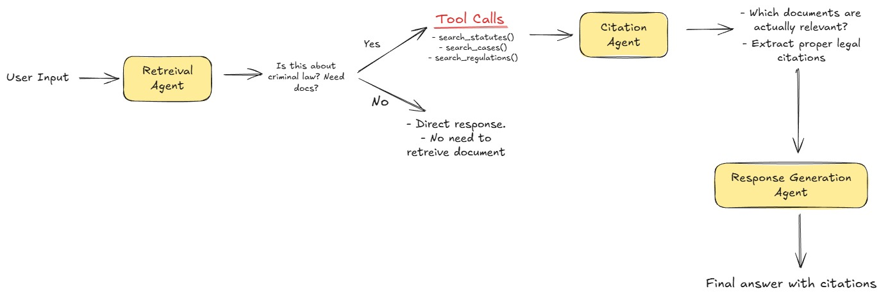

# Legal RAG 

## Project Overview

So I have implemented a multi-agent RAG system focused on Indian Criminal Law. The system uses multiple AI agents that work together to retrieve relevant legal information and generate accurate responses with proper citations.

## Documents

The documents I have added are organized into three categories:

### Statutes
1. The Indian Penal Code, 1860
2. The Code of Criminal Procedure, 1973
3. The Indian Evidence Act, 1872
4. The Protection of Children from Sexual Offences Act, 2012 (POCSO)
5. The Scheduled Castes and Scheduled Tribes (Prevention of Atrocities) Act, 1989

### Case Laws
1. Bachan Singh v. State of Punjab (1980) - Landmark death penalty judgement
2. Maneka Gandhi v. Union of India - Fundamental rights interpretation
3. Arnesh Kumar v. State of Bihar - Arrest guidelines
4. State of Maharashtra v. Madhukar Narayan Mardikar - Burden of proof
5. Vikas Yadav v. State of U.P. - Witness protection

### Regulations
1. Model Prison Manual for the Superintendence and Management of Prisons in India
2. The Model Police Act, 2006

## Architecture



So I’ve implemented a multi-agent RAG system for Criminal Law. 

The workflow goes like this:

### *1. Retrieval Agent*
This is the first agent everything goes through.

- If the user’s message is just a greeting → reply directly  
- If the question is not related to criminal law → it politely declines  
- If the question is about criminal law → it retrieves relevant documents  

The Retrieval Agent can call 3 tools:
- search_statutes() → searches IPC, CrPC, Evidence Act etc.  
- search_cases() → searches case laws  
- search_regulations() → searches rules and manuals  

It returns the top relevant chunks (up to ~30 total).

---

### *2. Citation Agent*
This agent takes the retrieved docs + the user question and filters out only the actually relevant citations. Not every retrieved chunk is useful, so this agent picks the proper ones and formats the citations.

---

### *3. Response Generation Agent*
This is where the final legal answer is generated.  
It takes:
- the question  
- the retrieved docs  
- the formatted citations  

and generates a proper legal response with clear reasoning and neatly inserted citations.

---

All of this is orchestrated using *LangGraph*, which keeps a shared state object flowing across agents.


## Implementation

So I used *LangChain* + *LangGraph* for the multi-agent setup, and *Streamlit* for the frontend.

For vector search, I used *ChromaDB*. I’ve worked with FAISS before, but Chroma made more sense here because of easier persistence and simpler querying.

I’m using *Groq’s API* (llama-3.1-8b-instant) for the LLM and  
sentence-transformers/all-MiniLM-L6-v2 for embeddings.

### *LangGraph Workflow*

LangGraph uses nodes + edges:

*Nodes (agents):*
- retrieval_agent  
- citations  
- response_generation  

*Edges:*
- Retrieval → (if docs found) → Citations  
- Citations → Response  
- Response → END  
- If no docs needed → Retrieval → END  

*Shared State Object:*

```python
{
    "question": str,
    "messages": list,
    "retrieved_docs": dict,
    "citations": str,
    "final_answer": str
}

```

Why Streamlit?

I could’ve used React + FastAPI as well, but deploying the backend on free-tier hosting makes the application slow most of the time. Streamlit just makes deployment smooth and handles both frontend + backend in one place.

## Running the Application

### Streamlit UI 
```bash
# Activate virtual environment
source .venv/bin/activate

# Run the Streamlit app
streamlit run app.py
```

